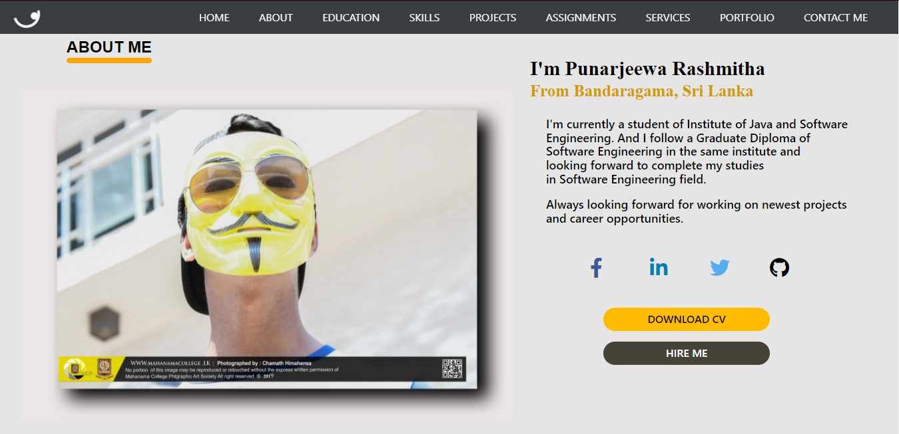
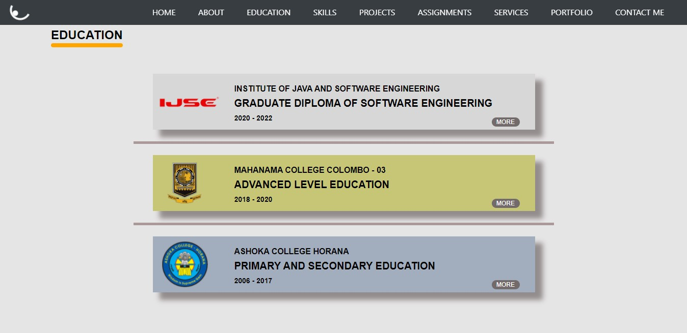
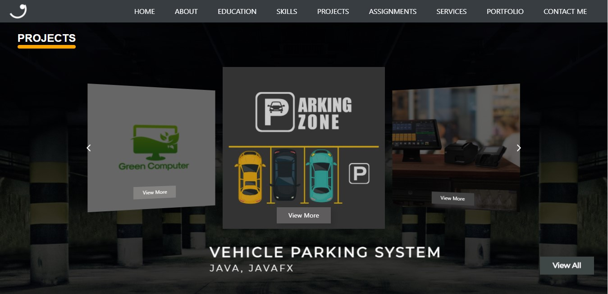
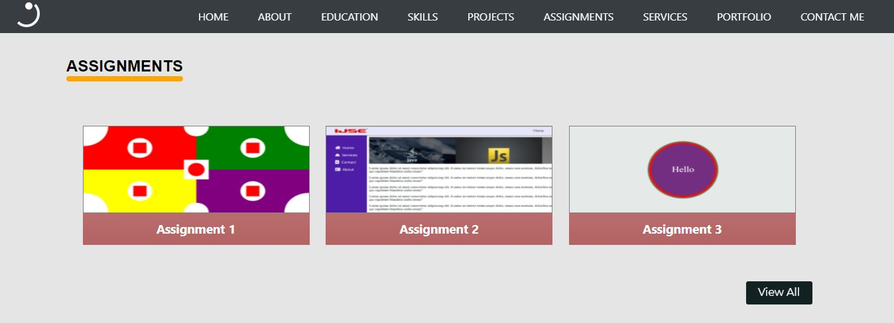
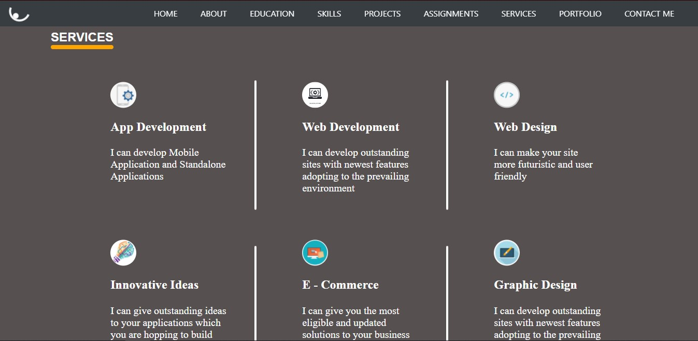
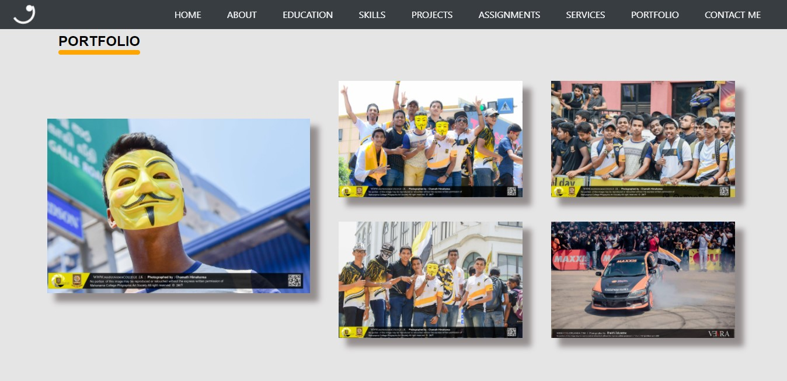
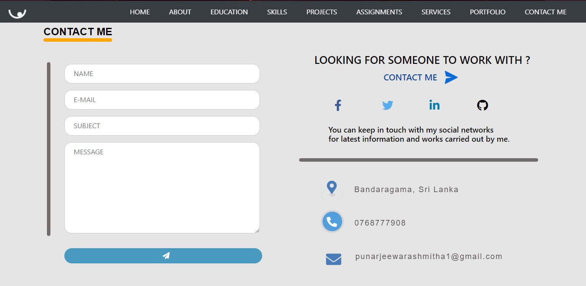

 
**This is the direct link of my portfolio github page URL  -  **
[Click the Link](https://punarjeewarashmitha20011016.github.io/MyProfile/)
 
**This is the direct link of my portfolio OOWebHost page URL  -  **
[Click the Link](https://punarjeewarashmitha.000webhostapp.com/)
 
**This is the direct link of my portfolio website mockup made using Figma  -  **
[Click the Link](https://www.figma.com/proto/wKAM2H5WzxQerV9nqPb2In/Untitled?node-id=5%3A329&scaling=scale-down&page-id=0%3A1&starting-point-node-id=1%3A2)
 
**This is the direct link of my portfolio website wireframe  -  **
[Click the Link](https://wireframe.cc/iloEGs)
 
**This is the direct link of my portfolio website sitemap  -  **
[Click the Link](https://www.gloomaps.com/zlJh7m2bet)
 
**This is the direct link of my linkedIn profile  -  **
[Click the Link]( https://www.linkedin.com/in/punarjeewa-rashmitha-59a4a3223/)
 
 
 
_This is the up-to-date output of My Profile Home section._
 
 

 
_This is the up-to-date output of My Profile About section._
 
 

 
_This is the up-to-date output of My Profile Education section._
 
 

 
_This is the up-to-date output of My Profile Skills section._
 
 

 
_This is the up-to-date output of My Profile Projects section._
 
 

 
_This is the up-to-date output of My Profile Assignments section._
 
 

 
_This is the up-to-date output of My Profile Services section._
 
 

 
_This is the up-to-date output of My Profile Portfolio section._
 
 

 
_This is the up-to-date output of My Profile Contact Me section._
 
 

